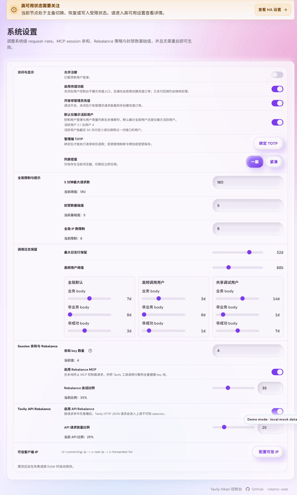
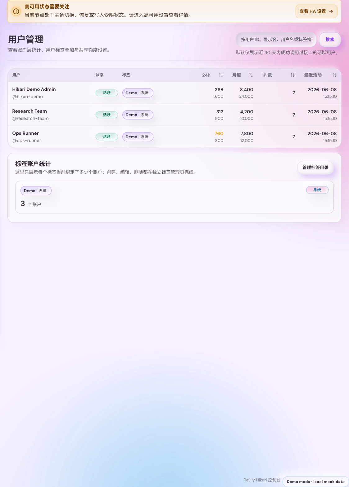

# 管理端活跃用户默认展示过滤（#hta54）

> 当前有效规范以本文为准；实现覆盖与当前状态见 `./IMPLEMENTATION.md`，关键演进原因见 `./HISTORY.md`。

## 背景 / 问题陈述

- 管理端用户列表与用户用量页默认展示全部账户，包含长期没有成功调用记录的噪声账户，日常管理时会明显干扰排查与配额操作。
- 现有搜索语义本质上是“在当前列表中继续过滤”，如果默认就裁掉无效用户，又不恢复到全量集合搜索，会直接导致管理员漏查用户。
- 系统设置页目前没有全局开关来统一约束这两类列表的默认展示策略，也没有直接给出“有效用户 / 总用户数”统计，管理员很难快速判断过滤影响面。

## 目标 / 非目标

### Goals

- 新增一个全局系统设置，控制管理端用户列表与用户用量页默认显示全部用户还是仅显示活跃用户。
- 将“活跃用户”固定定义为“最近 90 天内至少有一次成功接口调用的用户”，并由后端统一口径判定。
- 当搜索词为空时遵守默认活跃过滤；当搜索词非空时恢复为在全部用户集合内搜索，避免遗漏非活跃用户。
- 在系统设置页展示活跃用户 / 总用户数，并明确活跃定义。
- 为用户列表与用户用量页增加轻量状态提示，明确当前是默认活跃过滤还是搜索已扩展到全量。

### Non-goals

- 不把 90 天窗口改成可配置项。
- 不给用户列表再增加单独的局部过滤开关。
- 不改动用户详情页、未关联 Token 用量页、Token 列表或其他模块的过滤语义。
- 不改变用户搜索字段集合，仍只按现有用户 ID、用户名、显示名与标签匹配。

## 范围（Scope）

### In scope

- Rust `SystemSettings`、系统设置读写 DTO、`GET /api/settings` 聚合响应。
- `/api/users` 查询参数扩展：`activityScope=all|active90d`。
- 活跃用户统计查询与活跃过滤 SQL。
- 管理端系统设置页、用户列表页、用户用量页、相关 i18n、Storybook 状态与前端测试。
- 服务端测试覆盖设置回读、活跃过滤、排序路径一致性与 90 天口径。

### Out of scope

- 新增独立统计接口。
- 调整任何非用户列表页面的默认过滤行为。
- 把活跃过滤状态编码进永久 URL 参数。

## 需求（Requirements）

### MUST

- `SystemSettings` 必须新增 `adminDefaultActiveUsersOnly` 布尔字段，并持久化为全局设置。
- `GET /api/settings` 必须返回只读 `adminUserListStats`，至少包含 `activeUsers90d`、`totalUsers`、`windowDays`。
- `GET /api/users` 必须接受 `activityScope=all|active90d`，并在默认分页、显式排序分页、排序后回退查询三条路径上都遵守相同过滤语义。
- 活跃判定必须基于 `auth_token_logs.request_user_id = users.id`、`result_status = 'success'`、`created_at >= now - 90 days`。
- 当前端搜索词为空且系统设置开启时，用户列表与用户用量页默认只展示活跃用户。
- 当前端搜索词非空时，列表请求必须强制使用 `activityScope=all`，同时保留标签、排序、分页与当前视图语义。

### SHOULD

- 设置页复用现有 clay admin 风格，不引入新的重型视觉容器。
- 状态提示文案应直接说明“默认只展示活跃用户”与“搜索已扩展到全部用户集合”。
- Storybook 应提供默认活跃过滤与搜索回全量的稳定状态故事。

### COULD

- 设置说明文案补充“最近 90 天成功调用过接口”的完整定义。

## 功能与行为规格（Functional/Behavior Spec）

### Core flows

- 管理员进入系统设置页时，可查看“活跃用户默认展示”开关，以及活跃用户 / 总用户数。
- 管理员开启该开关后，`/admin/users` 与 `/admin/users/usage` 在空搜索条件下只显示活跃用户。
- 管理员输入搜索词并提交后，请求范围扩展到全部用户集合，此时非活跃但名称/标签匹配的用户也必须可见。
- 管理员清空搜索后，页面恢复使用系统设置驱动的默认过滤范围。

### Edge cases / errors

- 历史 `auth_token_logs` 中缺失 `request_user_id` 的旧数据不得误算为活跃用户。
- 仅有失败调用或超过 90 天的成功调用不得算作活跃用户。
- 设置写接口收到旧 payload 且未携带 `adminDefaultActiveUsersOnly` 时，应沿用现有设置值。

## 接口契约（Interfaces & Contracts）

### 接口清单（Inventory）

| 接口（Name）                                 | 类型（Kind） | 范围（Scope） | 变更（Change） | 契约文档（Contract Doc） | 负责人（Owner） | 使用方（Consumers） | 备注（Notes）                 |
| -------------------------------------------- | ------------ | ------------- | -------------- | ------------------------ | --------------- | ------------------- | ----------------------------- |
| `SystemSettings.adminDefaultActiveUsersOnly` | DTO          | external      | Modify         | None                     | backend + web   | admin settings UI   | 全局默认活跃过滤开关          |
| `GET /api/settings`                          | HTTP API     | external      | Modify         | None                     | backend         | admin settings UI   | 新增只读 `adminUserListStats` |
| `GET /api/users.activityScope`               | HTTP API     | external      | Modify         | None                     | backend         | admin users / usage | `all` or `active90d`          |
| `AdminUserListStats`                         | DTO          | external      | New            | None                     | backend + web   | admin settings UI   | 活跃/总用户统计               |

### 契约文档（按 Kind 拆分）

- None

## 验收标准（Acceptance Criteria）

- Given 系统设置页加载完成
  When 管理员查看访问与显示设置
  Then 页面展示活跃用户默认展示开关、活跃用户 / 总用户数、以及“最近 90 天成功调用过接口”的定义说明。

- Given `adminDefaultActiveUsersOnly = true`
  When 管理员在 `/admin/users` 或 `/admin/users/usage` 保持搜索词为空
  Then 页面仅展示最近 90 天内有成功调用记录的用户，并显示默认活跃过滤提示。

- Given `adminDefaultActiveUsersOnly = true`
  When 管理员输入搜索词并提交
  Then 页面改为在全部用户集合内搜索，并显示“搜索已扩展到全部用户集合”的提示。

- Given 某用户只有失败调用、无 `request_user_id` 的历史调用，或成功调用已超过 90 天
  When 管理员使用 `activityScope=active90d`
  Then 该用户不会出现在结果内。

- Given 管理员在活跃过滤开启状态下选择排序或标签筛选
  When 切换搜索词为空 / 非空
  Then 标签、排序、分页与当前列表视图的既有语义保持不变，只有活动范围按规则切换。

## 验收清单（Acceptance checklist）

- [x] 核心路径的长期行为已被明确描述。
- [x] 关键边界/错误场景已被覆盖。
- [x] 涉及的接口/契约已写清楚或明确为 `None`。
- [x] 相关验收条件已经可以用于实现与 review 对齐。

## 非功能性验收 / 质量门槛（Quality Gates）

### Testing

- Rust targeted tests: `cargo test admin_system_settings_put_preserves_request_rate_limit_when_legacy_payload_omits_it -- --exact`
- Rust targeted tests: `cargo test admin_user_management_lists_details_and_updates_quota -- --exact`
- Frontend tests: `cd web && bun test src/admin/userActivityScope.test.ts src/admin/SystemSettingsModule.render.test.ts src/admin/SystemSettingsModule.interaction.test.tsx src/admin/AdminPages.stories.test.ts src/api.test.ts`
- Frontend build: `cd web && bun run build`

### UI / Storybook (if applicable)

- Stories to add/update:
  - `web/src/admin/SystemSettingsModule.stories.tsx`
  - `web/src/admin/AdminPages.stories.tsx`
  - `web/src/admin/storySupport/AdminPagesStoryRuntime.tsx`
- Docs pages / state galleries to add/update: existing `Admin/SystemSettingsModule` and `Admin/Pages` entries.
- `play` / interaction coverage to add/update: admin pages users / usage search stories remain interactive; active-only proof relies on stable story states plus static render assertions.

### Quality checks

- `cargo test --no-run`
- `cd web && bun run build`
- `cd web && bun test`

## Visual Evidence

- `source_type=ui_demo`, `target_program=mock-only`, `capture_scope=element`,
  `requested_viewport=1440x1400`, `viewport_strategy=devtools-emulate`,
  `sensitive_exclusion=N/A`, `submission_gate=pending-owner-approval`

- `story_id_or_title=/admin/system-settings?demo=1`
  `state=active users default enabled`
  `evidence_note=在真实 admin shell 的 demo 模式中验证系统设置页新增全局开关、活跃用户/总用户计数与 90 天口径说明同时展示`
  

- `story_id_or_title=/admin/users?demo=1`
  `state=default active-only users list`
  `evidence_note=在真实 admin shell 的 demo 模式中验证用户管理默认列表在未搜索时只展示活跃用户，并展示默认过滤提示`
  

- `story_id_or_title=/admin/users?demo=1&q=charlie`
  `state=search expands to all users`
  `evidence_note=在真实 admin shell 的 demo 模式中验证输入搜索词后恢复到全部用户集合，能找回非活跃用户并展示搜索扩展提示`
  

## Related PRs

- None

## 风险 / 开放问题 / 假设（Risks, Open Questions, Assumptions）

- 风险：如果未来还存在更多依赖 `/api/users` 的页面但未显式传 `activityScope`，可能无意继承默认全量行为，需要后续继续审视调用点。
- 风险：活跃统计依赖 `auth_token_logs.request_user_id`，历史缺字段数据不会被回补为活跃用户，这是本轮刻意选择的保守口径。
- 假设（需主人确认）：owner-facing 名称固定使用“活跃用户”，并以辅助文案解释 90 天成功调用定义。

## 参考（References）

- `docs/specs/rwspk-admin-users-list-sorting-layout/SPEC.md`
- `docs/specs/hwrpf-admin-user-usage-hide-token-count/SPEC.md`
- `docs/specs/tjhrr-system-request-rate-limit-setting/SPEC.md`
